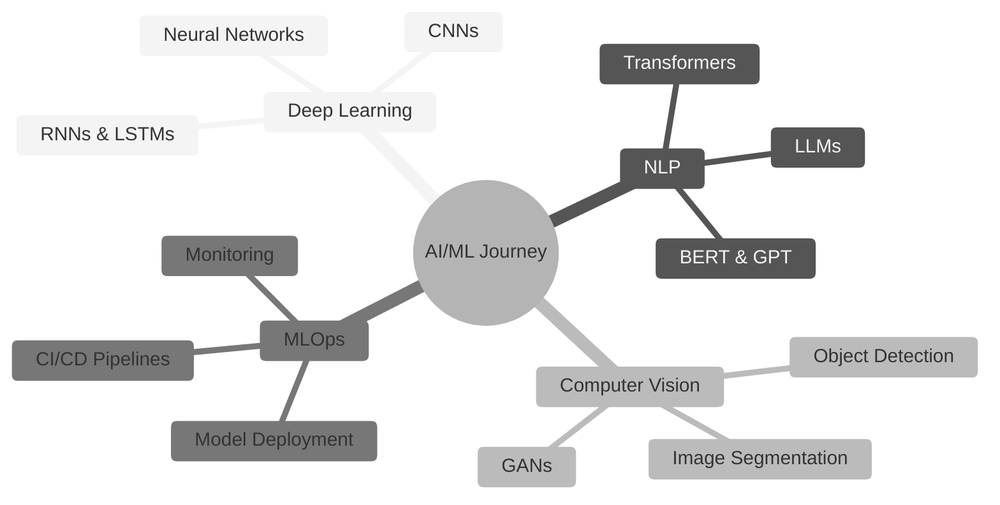

<div align="center">
  
</div>

<div align="center">
  
</div>
<br />

<br />

## 🧬 About Me

```python
class DataScientist:
    def __init__(self):
        self.name = "Sohail Shaikh"
        self.role = "Data Scientist & AI/ML Engineer"
        self.location = "🌍 Earth"
        self.interests = ["Machine Learning", "Deep Learning", "NLP", "Computer Vision"]
        self.currently_learning = ["Transformers", "LLMs", "MLOps"]
        
    def say_hi(self):
        print("Thanks for dropping by! Let's build something intelligent together.")
        
    def get_tech_stack(self):
        return {
            "languages": ["Python", "R", "SQL"],
            "ml_frameworks": ["TensorFlow", "PyTorch", "Scikit-learn", "Keras"],
            "data_tools": ["Pandas", "NumPy", "Matplotlib", "Seaborn"],
            "mlops": ["MLflow", "Docker", "Kubernetes"],
            "cloud": ["AWS", "Google Cloud", "Azure"],
            "databases": ["PostgreSQL", "MongoDB", "MySQL"]
        }

me = DataScientist()
me.say_hi()
```
<br />

<br />

## 🛠️ Tech Arsenal

<div align="center">

### 💻 Languages & Core


### 🤖 AI/ML Frameworks


### 📊 Data Visualization & Analysis


### ☁️ Cloud & MLOps


### 🗄️ Databases


</div>
<br />

<br />

## 📈 GitHub Analytics

<div align="center">
  
  
</div>
<br />

<br />

## 📊 Contribution Activity

<div align="center">
  
</div>

<div align="center">
  
  
</div>
<br />

<br />

## 🐍 Contribution Snake

<div align="center">
  
</div>
<br />

<br />

## 🚀 Featured Projects

<div align="center">
<table border="0" cellspacing="0" cellpadding="0" width="100%">
<tr>
<td width="50%" align="center" valign="top">
<br />

<p><b><font color="#9f7aea" size="4">✨ LLM Framework</font></b><br /><i>A powerful Python package for seamless interaction with Large Language Models.</i></p>
<a href="https://github.com/Sohail-Shaikh-07/TextxGen"></a>
<a href="https://pystack.site/"></a>
<br /><br />
</td>
<td width="50%" align="center" valign="top">
<br />

<p><b><font color="#4299e1" size="4">🤖 Agentic Workflows</font></b><br /><i>Multiple AI Agent workflow mono repository for advanced automation.</i></p>
<a href="https://github.com/Sohail-Shaikh-07/AI-Agents"></a>
<br /><br />
</td>
</tr>
</table>
<br />

<br />
</div>

<!-- You can also manually showcase projects like this:
<div align="center">
  
### 🔥 [Project Name 1](https://github.com/Sohail-Shaikh-07/project-name)
Brief description of your amazing AI/ML project

### 🔥 [Project Name 2](https://github.com/Sohail-Shaikh-07/project-name)
Brief description of another cool project

</div>
-->

<br>

## 🎯 Current Focus

<div align="center">



</div>
<br />

<br />

## 🤝 Let's Connect

<div align="center">
  
[](https://x.com/sohails_07)
[](https://www.instagram.com/sohails_07/)
[](https://www.kaggle.com/sohails07)
[](mailto:sohails07shaikh@gmail.com)
[](https://yourwebsite.com)

</div>
<br />

<br />

## 💭 Random AI Quote

<div align="center">

</div>


<div align="center">


<p><strong>🌟 Thanks for visiting! Let’s innovate with AI together 🤖</strong></p>

</div>
